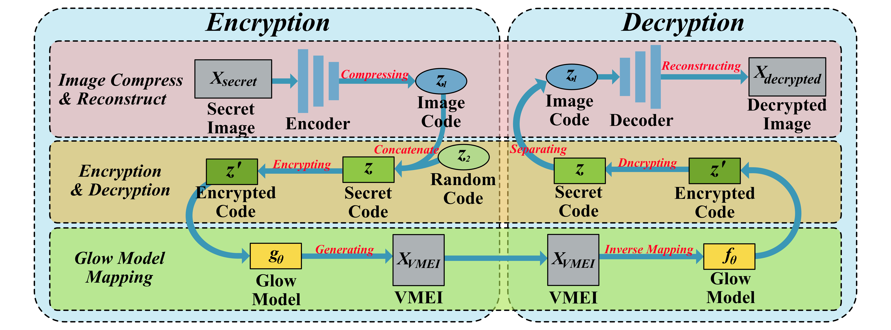

# VMIE

Official implementation of **"Visually Meaningful Encryption via Image-to-Image Reversible Transformation"** (IEEE Transactions on Dependable and Secure Computing).



VMIE is a visually meaningful encryption scheme that requires **no cover image**: the secret image is compressed by a Deep Compression AutoEncoder (DCAE), encrypted with a chaotic map, and mapped into a visually meaningful image through the **reverse** pass of a Glow flow. The original content is recovered by running the pipeline backwards (Glow `forward` → chaotic decryption → DCAE reconstruction).

## Repository structure

| Path | Description |
|---|---|
| `main.py` | End-to-end demo: encrypt an image → VMEI image → decrypt → PSNR/SSIM |
| `model.py` | Glow model. **Modified** so that `forward()` is the exact numerical inverse of `reverse()` |
| `DC_AE.py` | DCAE network (encoder: 128×128×3 → 16×16×128 latent, decoder restores it) |
| `vector_chao_map.py` | Logistic-map based scrambling |
| `glow-train/` | Glow **training** code (`glow_train.py` + our modified `model.py`) — see the note below before training |
| `DCAE-train/` | DCAE **training** code (`train_DCAE.py` + a local copy of `DC_AE.py`, self-contained) — automatically exports a `main.py`-ready weight at the end of training |
| `model_weight/` | Pretrained weights (Git LFS, or download from [Releases](https://github.com/AIMS-Group-ZhiliZhou/VMEI/releases/tag/Pretrained_weights)) |
| `img/`, `picture/` | Sample images, framework figure |

## Requirements

- Python ≥ 3.9
- PyTorch ≥ 2.0

## Pretrained weights

The official weights used in the paper's experiments are stored in the repository via **Git LFS** and are also attached to the [Releases](https://github.com/AIMS-Group-ZhiliZhou/VMEI/releases/tag/Pretrained_weights) page as a fallback channel.

| File | Size |
|---|---|
| `Glow_0400001.pt` | 240 MB (251,885,070 bytes) |
| `DCAE.pth` | 12 MB (12,343,463 bytes) |

**Option A — Git LFS (in-repo).** After cloning:

```bash
git lfs install    # once per machine
git lfs pull       # replaces the pointer files with the real weights
```

A plain clone leaves the two files under `model_weight/` as small pointer texts (~130 bytes) — that is normal; `git lfs pull` fills them in.

**Option B — GitHub Release (fallback).** When the LFS bandwidth quota is exhausted (1 GB/month on a free account, roughly four full downloads), download both files from the [Releases](https://github.com/AIMS-Group-ZhiliZhou/VMEI/releases/tag/Pretrained_weights) page instead and place them into `model_weight/`:

```
VMIE/
└── model_weight/
    ├── Glow_0400001.pt
    └── DCAE.pth
```

> **Important:** the Glow checkpoint must be loaded with the repository's modified `model.py` — the one used by `main.py` and already bundled in `glow-train/`. Do **not** replace it with the upstream glow-pytorch version; see the note in the Glow training section below.

## Quick start (inference demo)

```bash
python main.py
```

`main.py` encrypts `img/cat.png` into a visually meaningful image (`img/VMEI.png`, 16-bit PNG), then decrypts it back and prints the PSNR / SSIM of the recovered image. Two matplotlib windows pop up during the run — close them to let the script finish.

Customise the run by editing the variables at the top of `main.py`:

```python
image_path = "img/cat.png"                    # input image
encrypted_key = [3.9999, 0.666, 5000, 5000]   # logistic-map key: [mu, x0, m, n]
decrypted_key = [3.9999, 0.666, 5000, 5000]   # decryption key
```

## Training

### DCAE — `DCAE-train/`

```bash
python DCAE-train/train_DCAE.py --data /path/to/coco/train2017
```

All defaults reproduce the configuration reported in the paper (Section IV-A):

| Setting | Value |
|---|---|
| Data | COCO 2017 train split (118,000 images, 80 object categories), 10,000 randomly selected images to form the DCAE training set (the script fixes the selection with seed 2025 by default) |
| Preprocessing | short-side resize + center crop to 128×128, random horizontal flip, [0, 1] |
| Optimizer | Adam, lr = 1e-4 |
| Schedule | 300 epochs, batch size 32 |
| Loss | `L = 1.0·L1 + 1.0·(1 − SSIM)` |

Useful options: `--resume` (continue from a checkpoint), `--loss mse_ssim|l1|mse`, `--epochs`, `--batch`, `--workers`. Outputs are written to `checkpoint_dcae/`: `dcae_latest.pt`, `dcae_best.pt`, `train_log.csv`,`train_curve.png`.

Training checkpoints store `{"model", "optim", "epoch", ...}` so that training can be resumed. When training finishes, the script **automatically exports** `checkpoint_dcae/DCAE.pth` — a plain state_dict in exactly the format `main.py` loads (taken from the best-PSNR epoch).

`--export <path>` redirects the export target (e.g. `--export model_weight/DCAE.pth` writes straight into place — note this **overwrites** the released pretrained weight).

### Glow — `glow-train/`

> **⚠️ Keep the bundled `model.py` — do not replace it with the upstream glow-pytorch version.**
>
> The `model.py` in `glow-train/` is already our modified version, identical to the repository root `model.py` that `main.py` uses. Its only difference from the original glow-pytorch model is in `Block.forward()`: the split outputs `z_new` are returned as the standardised latents `(z − mean) / exp(log_sd)` instead of being resampled from the learned prior (`gaussian_sample(eps, mean, log_sd)`). VMIE requires `forward()` and `reverse()` to be exact numerical inverses of each other; with the upstream version, the decryption step of `main.py` would recover a noise-corrupted image instead of the true secret.

Training command:

```bash
cd glow-train
python glow_train.py --img_size 256 --batch 4 --iter 400000 /path/to/celeba_hq
```

| Setting | Value |
|---|---|
| Architecture | `n_flow=32`, `n_block=4` |
| Data | **CelebA-HQ** (30,000 high-resolution facial images), per the original Glow paper's setting, so that Glow generates realistic facial images; images are resized to 256×256 to improve training efficiency |
| Optimizer | Adam, lr = 1e-4 |
| Iterations | 400,000 iterations (`--iter 400000`) |
| Sampling temperature | 0.7 (the original Glow paper's setting) |

Notes:

- The `sample/` and `checkpoint/` output folders are created automatically at startup.
- `--workers` controls data loading (default 4); set `--workers 0` if you run into multiprocessing issues on Windows.
- **VRAM:** at 256×256 in fp32 the model needs ≈ 4.2 GiB **per image** plus ~1 GiB of parameters / optimizer state a 24 GB GPU fits `--batch` 4. Reduce the batch size on smaller cards.
- Although Glow is trained at 256×256, the size of the images it produces differs from its training image size — the generated images are 128×128.
- `glow_train.py` uses `torchvision.datasets.ImageFolder`, so the data path must contain **at least one sub-directory** of images (e.g. `image_folder/class_a/*.jpg`). A completely flat folder will not be found.
- Checkpoints are saved to `checkpoint/model_XXXXXX.pt` every 10,000 iterations; the released `Glow_0400001.pt` corresponds to iteration 400,001.
- `glow_train.py` wraps the model in `nn.DataParallel`, so checkpoints carry a `module.` prefix on every key. Strip it before use with `main.py`:

```python
import torch
sd = torch.load("checkpoint/model_400001.pt", map_location="cpu")
sd = {k.replace("module.", "", 1): v for k, v in sd.items()}
torch.save(sd, "../model_weight/Glow_0400001.pt")
```

## Datasets

| Dataset | Used for | Link |
|---|---|---|
| COCO 2017 | **DCAE training** (10,000 images randomly selected from the 118,000-image train split); **evaluation** (val split) | [cocodataset.org](http://cocodataset.org/#download) |
| CelebA-HQ | **Glow training** (30,000 high-resolution facial images), resized to 256×256 to improve training efficiency. The link provided points to the CelebA dataset; CelebA-HQ is obtained by further processing CelebA. | [CelebA](https://mmlab.ie.cuhk.edu.hk/projects/CelebA.html) |
| DIV2K | **evaluation** (valid split) | [DIV2K](https://data.vision.ee.ethz.ch/cvl/DIV2K) |

No dataset is needed to run the `main.py` demo (it uses `img/cat.png`).

## Reproducibility notes

- The DCAE training script is a reconstruction of the configuration documented in the paper; the Glow training code follows  [chaiyujin/glow-pytorch](https://github.com/chaiyujin/glow-pytorch), with the `model.py` modification described above.

## Citation

If this code or the pretrained weights are useful to your research, please cite our paper:

```bibtex
@article{yang2025visually,
  title={Visually Meaningful Encryption via Image-to-Image Reversible Transformation},
  author={Yang, Jianfeng and Zhou, Zhili and Liu, Yuhuan and Liao, Daizhi and Zheng, Yifeng},
  journal={IEEE Transactions on Dependable and Secure Computing},
  year={2025},
  publisher={IEEE}
}
```

## Acknowledgements

The Glow training code (`glow-train/`) is adapted from [chaiyujin/glow-pytorch](https://github.com/chaiyujin/glow-pytorch), which is itself based on [rosinality/glow-pytorch](https://github.com/rosinality/glow-pytorch). Both are MIT-licensed; the upstream license notices are preserved in `glow-train/LICENSE`.

## License

The code and pretrained weights in this repository are released under an **academic research license** — see the root [LICENSE](LICENSE) file: non-commercial academic research and educational use only, with citation of the paper above; commercial use requires prior written permission from the authors. The `glow-train/` subfolder remains under its upstream MIT license (see `glow-train/LICENSE`).
